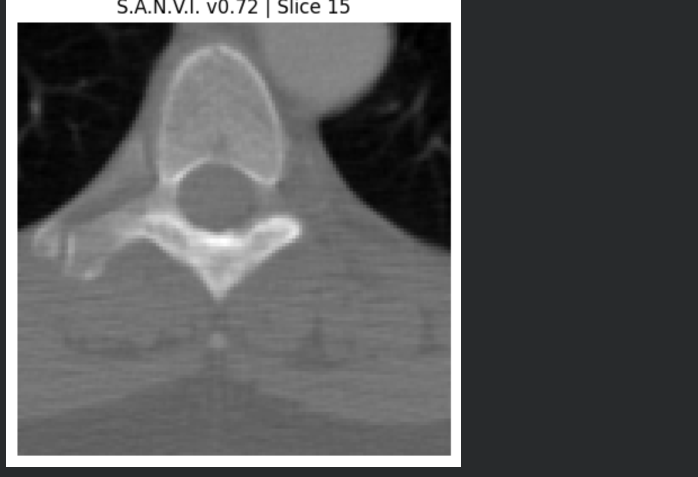
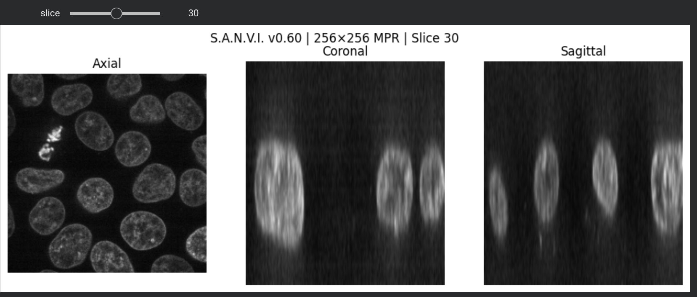

# Surgical Simulation Research

An early-stage research prototype exploring interactive medical imaging, 3D visualization, and surgical simulation.

## Vision

The long-term goal is to explore patient-specific surgical simulation through interactive medical imaging, biomechanics, and visualization.

## Prototype Preview

### Real CT Slice

### Multi-Planar Reconstruction (MPR)

### Interactive Tissue Deformation

## Current Milestones

- DICOM workflow exploration
- Multi-planar image viewing (Axial, Coronal, and Sagittal)
- Interactive tissue deformation prototype
- Force and stiffness simulation
- Live deformation metrics
- Bone-lock behavior exploration

## About This Repository

This repository documents the early stages of an ongoing research journey into interactive medical imaging and surgical simulation. Each milestone represents a documented prototype as the project evolves.
